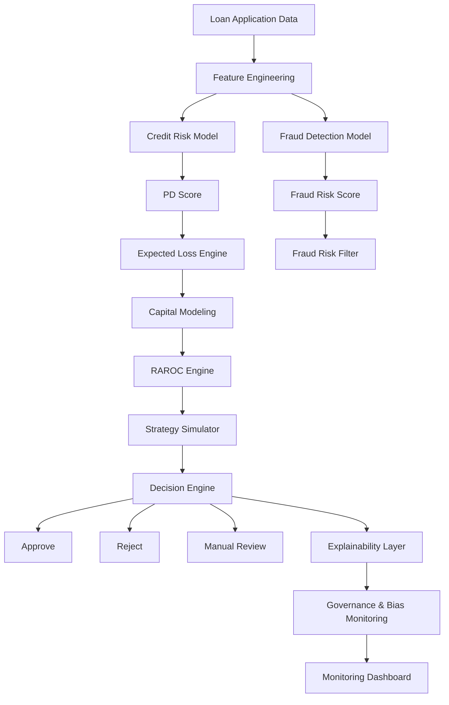

# 📊 AI Risk Decisioning System


An **AI-powered lending risk decision platform** designed to optimize credit growth while maintaining **portfolio risk limits and capital efficiency**.

This project simulates how modern financial institutions use **machine learning, financial risk modeling, and strategy simulation** to automate lending decisions.

The platform integrates:

* Credit risk modeling
* Fraud detection
* Expected loss estimation
* Capital allocation modeling
* Risk-adjusted return optimization (RAROC)
* Lending strategy simulation
* Stress testing
* Responsible AI governance
* Portfolio monitoring dashboards

---

# 🎥 Demo

```
docs/demo.gif
```


---

# 🏗 System Architecture



---

# 🚀 Key System Modules

## 1️⃣ Credit Risk Modeling

Predict **probability of default (PD)** using machine learning.

Models implemented:

* Logistic Regression
* Random Forest
* XGBoost

Evaluation metrics:

* AUC
* KS Statistic
* Precision / Recall

---

## 2️⃣ Fraud Detection System

Detect suspicious or fraudulent loan applications.

Outputs:

* Fraud probability score
* Fraud alert classification

---

## 3️⃣ Expected Loss Engine

Expected loss is calculated using the standard banking formula.

```
Expected Loss = PD × LGD × EAD
```

Where:

| Variable | Meaning                |
| -------- | ---------------------- |
| PD       | Probability of Default |
| LGD      | Loss Given Default     |
| EAD      | Exposure at Default    |

Outputs:

* Loan-level expected loss
* Portfolio expected loss

---

## 4️⃣ Capital Modeling

Simulates regulatory capital requirements.

```
RWA = Exposure × Risk Weight
Capital Required = RWA × Capital Ratio
```

Outputs:

* Risk-weighted assets
* Capital utilization
* Capital efficiency metrics

---

## 5️⃣ RAROC Engine

Risk Adjusted Return on Capital evaluates whether lending strategies generate economic value.

```
RAROC =
(Net Interest Income − Expected Loss − Operating Cost)
/ Capital Required
```

Used for **strategy comparison and portfolio optimization**.

---

## 6️⃣ Strategy Simulator

Simulates multiple lending strategies.

### Aggressive Growth

Higher approvals, higher risk.

### Conservative Filtering

Lower approvals, safer portfolio.

### Risk-Based Pricing

Interest rates adjusted to borrower risk.

Outputs:

* Portfolio NPA
* Expected loss
* Revenue
* Capital usage
* RAROC

---

## 7️⃣ Stress Testing Simulator

Evaluates portfolio resilience during economic downturns.

| Scenario      | PD Change | LGD Change |
| ------------- | --------- | ---------- |
| Base Case     | 0%        | 0%         |
| Mild Stress   | +15%      | +5%        |
| Severe Stress | +35%      | +15%       |

Outputs:

* Expected loss under stress
* Capital impact
* Portfolio stability

---

## 8️⃣ Decision Engine

Combines risk signals to generate automated lending decisions.

Inputs:

* Credit risk score
* Fraud risk score
* Risk policy thresholds

Possible outcomes:

* Approve
* Reject
* Manual review

---

## 9️⃣ Responsible AI Governance

Ensures fairness and transparency.

Includes:

* SHAP explainability
* Feature importance
* Bias monitoring
* Fairness checks

---

## 🔟 Monitoring Dashboard

Tracks performance after deployment.

Monitors:

* Model drift
* PD distribution shifts
* Performance decay
* Manual override decisions

---

# 📊 Interactive Risk Command Center

The system includes a **Streamlit dashboard** for exploring the platform.

Features:

* KPI tracking
* Model comparison
* Strategy simulator
* Stress testing
* Portfolio analytics
* Project execution tracker

Run locally:

```bash
streamlit run final_bfsi_project_command_center_v3.py
```

---

# 📂 Project Structure

```
ai-risk-decisioning-system

data/
datasets used for training models

notebooks/
01_data_preprocessing.ipynb
02_credit_risk_model.ipynb
03_fraud_detection.ipynb

models/
trained ML models

financial_engine/
expected_loss.py
capital_model.py
raroc_engine.py

decision_engine/
approval_rules.py

stress_testing/
stress_simulator.py

governance/
bias_monitor.py
explainability.py

dashboard/
final_bfsi_project_command_center_v3.py

docs/
architecture_diagram.png
demo.gif

README.md
requirements.txt
```

---

# 📚 Datasets Used

Public lending datasets used for modeling.

* Home Credit Default Risk
* LendingClub Loan Data
* Give Me Some Credit

These datasets provide structured borrower information for credit risk modeling.

---

# 🧰 Technologies Used

Programming

* Python

Machine Learning

* Scikit-learn
* XGBoost

Data Processing

* Pandas
* NumPy

Visualization

* Matplotlib
* Streamlit

Explainability

* SHAP

---

# 🎯 Target Performance Metrics

| Metric              | Target |
| ------------------- | ------ |
| AUC                 | ≥ 0.80 |
| KS Statistic        | ≥ 0.40 |
| Portfolio NPA       | ≤ 5%   |
| RAROC               | ≥ 18%  |
| Capital Utilization | < 85%  |

---

# 🔮 Future Improvements

Possible extensions include:

* Real-time lending decision API
* Reinforcement learning for strategy optimization
* Advanced capital stress testing
* Dynamic portfolio allocation
* Regulatory compliance simulation

---

# 👩‍💻 Author

**Hiral Sarkar**

AI & Risk Analytics Enthusiast
Building **AI-driven financial decision systems for banking and fintech**.

---

# 📜 License

This project is intended for **educational and portfolio demonstration purposes**.

---

## ⭐ If you find this project interesting, consider starring the repository!

---
